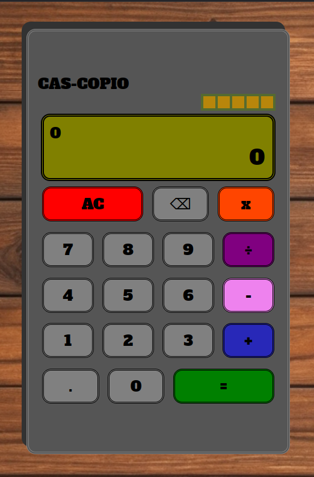

# calculator



## Summary

**Hosted:** [Calculator](https://blurryq.github.io/calculator/)

This project is my take on creating a functional online calculator. It’s been a fun and challenging build that dives into HTML, CSS, and JavaScript, all while tackling the complexities of responsive design and interactive components. With attention to layout and detail, I aimed to blend aesthetics with functionality, all organized through modular, clean code.

## Features

This calculator showcases my knowledge of HTML, CSS, and JavaScript and includes:

- **Calculator UI**: A sleek, classic calculator interface with a branded header, a display screen for ongoing calculations, and a unique button layout that resembles a physical calculator.
- **Responsive Design**: Using flexible CSS properties like calc() and vw units, the calculator adapts seamlessly across screen sizes, ensuring accessibility and usability.
- **Interactive Buttons**: Buttons with different colors and hover states based on their function (numbers, operations, etc.), adding an intuitive feel to the UI.
- **Keyboard Support**: Users can operate the calculator via keyboard inputs for a more dynamic user experience.
- **Error Handling**: Detects and displays errors like division by zero, with special messages for an engaging user experience.
- **Digit Limit Notifications**: Notifies users when the maximum digit count is reached to prevent overflow.

## Setup

To get started with this project, follow the steps below:

### 1. Fork the Repository

First, you need to fork this repository to your GitHub account by clicking the "Fork" button near the top right of this page. If you are unfamiliar with this process, please follow this GitHub [guide](https://docs.github.com/en/pull-requests/collaborating-with-pull-requests/working-with-forks/fork-a-repo).

### 2. Clone the Repository

Next, clone the repository to your local machine using the following command. Make sure to replace `your-username` with your GitHub username:

```
git clone https://github.com/your-username/calculator
```

### 3. Running the File

Once cloned, navigate to your project folder, locate the HTML file, and double-click it. This should open the file in your default browser.

Alternatively, if you're using Visual Studio Code, you can install the "Live Server" extension and use it to launch the project by right-clicking on the HTML file and selecting **Open with Live Server**.

### 4. Have Fun

## Challenges

This project was a deep dive into interactive JavaScript and responsive CSS. Building it gave me confidence in working with conditional logic, DOM manipulation, and user interface design while managing multiple state changes for an intuitive user experience. It’s a blend of creativity, problem-solving, and technical rigor that demonstrates my growing comfort with front-end development.

- **Complex State Management**: Keeping track of multiple states (like the current input, operation, and result) required careful variable management and decision-making about when to reset or keep values.
- **Keyboard Integration**: Making keyboard inputs work alongside button clicks involved careful event handling and testing, as keycodes had to match the calculator’s operations precisely.
- **Error Display**: Crafting clear and informative error messages without overwhelming the display required thoughtful design choices, especially to maintain readability within the character limits.
- **Responsive Layout Adjustments**: Using vw and flexible units made the layout adapt to different screens, but it was tricky to maintain consistent button sizes and spacing across varying screen dimensions.